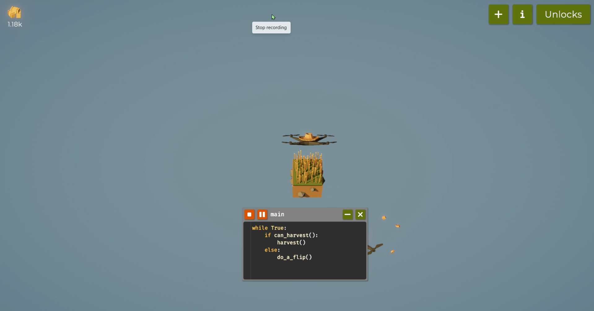
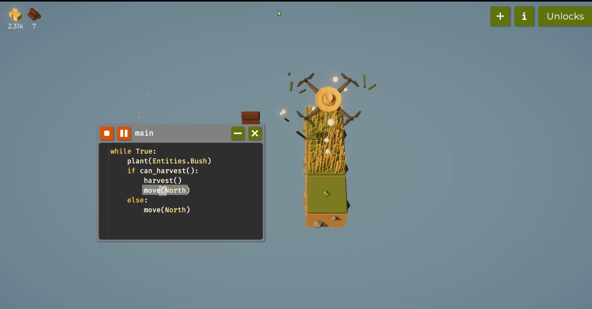
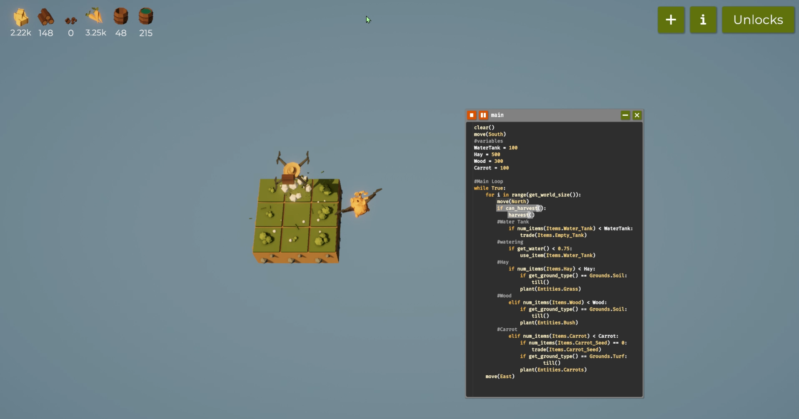
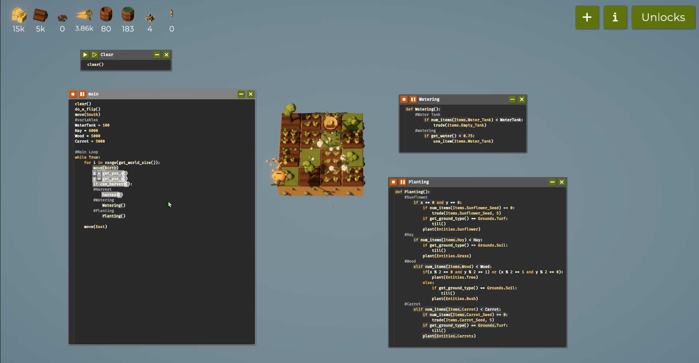
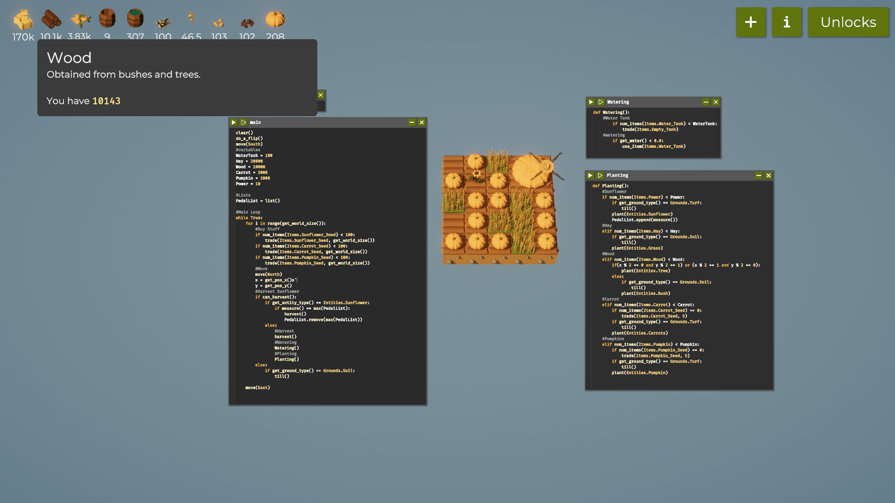
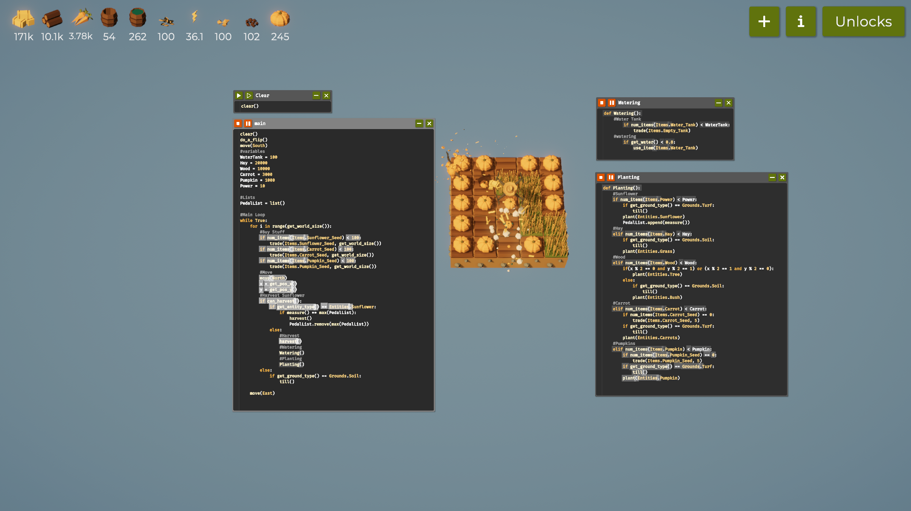

# SWE_CAP2_Game_Automation

# # Programming the Farming Drone (Report)
## Introduction
Farmer Was Replaced is a game where we have to code a drone to run a farm. We write programs to farm,  to maximize efficiency and manage the resources. The objective is to unlock advanced tech and become the most efficient farmer by optimizing the drone's operations. We have a drone that will follow the code to farm and theres a pig like drone to collect everything the drone harvests for the storage.

# Table of Contents
- [Code Snippets and Explanation](#code-snippets-and-explanation)
- [Challenges and Learnings](#challenges-and-learnings)
- [References](#references)

## Step 1: Farming on 1 tile
**Code:**
while True:
	if can_harvest():
		harvest()
	else:
		do_a_flip()

**Explanation:**
First command that we have is the Harvest command. We run the code couple of times and collect enough hay to unlock loop. And now we can put it in a loop and harvest saying while it's true harvest. We then upgrade the drone speed but the problem is when we harvest the crop too early, we destroy it and we dont collect anything so we give a if function which we unlocked and say if can harvest we want to harvest otherwise we wait for a little bit. So we can say else do a flip which is basically to wait.

**Pic:**

## Step 2: Farming on 3 tile
**Code:**
while True:
	plant(Entities.Bush)
	if can_harvest():
		harvest()
		move(North)
	else:
		move(North)
**Explanation:**
Now here we expand the tile for more yield production. we also unlock senses which is going to give us a whole bunch of commands for our surroundings. We have done upgrade with the hay for now and next we need to plant bushes.We plant Entities bush using this function. we collect enough stocks to upgrade and unlock other features.

**Pic:**

## Step 3: Farming on 3x3 tile
**Code:**
clear()
move(South)
#variables
WaterTank = 100
Hay = 500
Wood = 300
Carrot = 100

#Main Loop
while True:
	for i in range(get_world_size()):
		move(North)
		if can_harvest():
			harvest()
		#Water Tank
			if num_items(Items.Water_Tank) < WaterTank:
				trade(Items.Empty_Tank)
		#watering
			if get_water() < 0.75:
				use_item(Items.Water_Tank)
		#Hay				
			if num_items(Items.Hay) < Hay:
				if get_ground_type() == Grounds.Soil:
					till()
				plant(Entities.Grass)
		#Wood		
			elif num_items(Items.Wood) < Wood:
				if get_ground_type() == Grounds.Soil:
					till()
				plant(Entities.Bush)
		#Carrot		
			elif num_items(Items.Carrot) < Carrot:
				if num_items(Items.Carrot_Seed) == 0:
					trade(Items.Carrot_Seed)
				if get_ground_type() == Grounds.Turf:
						till()
				plant(Entities.Carrots)
	move(East)
**Explanation:**
We have collected enough yield to expand the tile to 3x3 for more production. unlocked operator so we get arithmetic operators, comparision operators and boolean operator. Expanding to 3x3 we also unlock for loop.
Now we run another code because we want to run a loop that checks all the field and return back. We get a variable get world size which is the size of our farm, then we want to move our drone to north and check if we can harvest and then harvest if we can. and now the intresting part here is we check what yield we are needing and we harvest according to our need. And we must also not forget to move east.
we have set a condition now saying when i have less then 600 hay i want to harvest hay and else we plant bush. We unlock carrot now but to plant carraot we need to purchase carrot seed first. And when our wood is less then 400 we harvest wood else if our carrot_seed is euqal to 0 then we have to buy the seed which we do that with the trade function, we just have to define what we have to buy. We also have to check the ground type and we have to tilt ground type basically its to togle between the ground types so we if the ground type is turf we want to tilt it and we plant entities carrot. To trade the for carrot seeds it costs me 1 wood each.
But then now are are planting the bushes on tilt soil but i want to tilt soil whenever we have something that requires it. So i want to until the the soil for both hay and bushes.

I now unlock water tank and we have a new item empty tank that will fill itself, the more empty tanks we have the faster they will fill and then also we have to get water estimate of how much water a soil already cointains and there are five levels. So if number of items of water tanks becuase we want the water tanks and then we are going to purchase if we need more filled up tanks. I'm going to do the watering if it is needed if the water is less then 0.5 (becuase its vale is between 0-1) then we use the item water tank.

I also want to keep track of the amount of carrot and harvest accordingly so we use elif instead of else and give the value like the other harvest sections above. We also unlocked variables so i can change the value of the items i need directly from the assigned variables and no need to touch in the main loop.

I unlocked the trees because i need more tree yield to produce enough water tanks. So now that we used varibales we can toggle and change the value of the items that we need to further upgrade the yields.

**Pic:**

**Notes**
Unlock water tank
unlock Variables
upgrade Trees

## Step 4: Farming on 4x4 tile
**Code:**
## Main Loop
clear()
do_a_flip()
move(South)
#variables
WaterTank = 100
Hay = 6000
Wood = 5000
Carrot = 5000

#Main Loop
while True:
	for i in range(get_world_size()):
		move(North)
		x = get_pos_x()
		y = get_pos_y()
		if can_harvest():
		#Harvest
			harvest()
		#Watering
			Watering()
		#Planting
			Planting()
		
	move(East)

## Function
def Planting():
	#Sunflower
		if x == 0 and y == 0:
			if num_items(Items.Sunflower_Seed) == 0:
				trade(Items.Sunflower_Seed, 5)
			if get_ground_type() == Grounds.Turf:
				till()
			plant(Entities.Sunflower)
	#Hay				
		if num_items(Items.Hay) < Hay:
			if get_ground_type() == Grounds.Soil:
				till()
			plant(Entities.Grass)
	#Wood		
		elif num_items(Items.Wood) < Wood:
			if(x % 2 == 0 and y % 2 == 1) or (x % 2 == 1 and y % 2 == 0):
				plant(Entities.Tree)
			else:	 
				if get_ground_type() == Grounds.Soil:
					till()
				plant(Entities.Bush)
	#Carrot		
		elif num_items(Items.Carrot) < Carrot:
			if num_items(Items.Carrot_Seed) == 0:
				trade(Items.Carrot_Seed, 5)
			if get_ground_type() == Grounds.Turf:
				till()
			plant(Entities.Carrots)

**Explanation:**
I am now going for another upgrade to expand the farm to 4x4. I used the get world size so it will cover the entire farm. Now when the trees are planted next to each other they will not yield as much so our goal should be to plant it in a checker board pattern. So in order to achieve that we give variable x and y, and the condition saying if the x is dividable by 2 and y isnt or if x isnt dividable by 2 and y is dividavle by 2 then we want to plant the tree.If this isnt the condition then  we want to do an else  statement because  then we want to plant the bushes. Also not to forget i kept upgrading the yield of different items.

Here I now unlocked the function so it would be much easier for me to just call the main function in the main loop and keep the rest of the statements in a seperate function and i just call the function in the main loop. We also went onto unlocking multitrade upgrade where it basically helps us buy something we can just purchase like buch of them at a time.
I unlocked a new item sunflower, they are a bit special so they have various amounts of petals and should only harvest the sunflower with the most petals and this is going to give the power and the power is then going to be used  by the Drone to be even faster. I am going to plant the sunflower in the first field so the power generated is used by the drone in the next following tiles. So making a another section in the planting function and we execute the code like in the carrots but now here we need not check for the current sunflower we have but we have to check for the  seeds and trade in seeds also we need to make sure the ground type is the right type.

Whenever i start the function i noticed it moves out of the way so i will do flip after the clear.

**Pic:**

**Notes**
- Using the code above I was able to get enough hay to unlock the tile.

- These features were unlocked too: variables and functions.
expanded farm.
function unlock 
unlock item sunflower

## Step 5: Farming on 5x5 tile
**Code:**
	#Pumpkins
		elif num_items(Items.Pumpkin) < Pumpkin:
			if num_items(Items.Pumpkin_Seed) == 0:
				trade(Items.Pumpkin_Seed, 5)
			if get_ground_type() == Grounds.Turf:
				till()
			plant(Entities.Pumpkin)

**Explanation:**
Now we also unlock pumpinks, we can basically repeat the carrot code to yield the pumpkin.

**Video Demo:**

**Notes**
- Using the code above I was able to get enough hay to unlock the tile.

- These features were unlocked too: variables and functions.
expanded farm.
unlock item pumpkin

## Step 6: Farming on 6x6 tile
**Code:**
def Planting():
	#Sunflower
	if num_items(Items.Power) < Power:
		if get_ground_type() == Grounds.Turf:
			till()
		plant(Entities.Sunflower)
		PedalList.append(measure())		

**Explanation:**
Considering there are five stages of watering i want to up the number of watering so we get one complete watered tile. We also keep upgrading other items. There is also fertilizer we are going to unlock fertilizer so the sunflower will grow faster but the problem with fertilizer is it dries up the ground. At the begining of each movement we're actually going to check whether or not we need some seeds and we're going  to purchasethem all up to 100 and also i am purchasing purchasing them upto the quantity of the world size.

**Pic:**

**Notes**
- Using the code above I was able to get enough hay to unlock the tile.

- These features were unlocked too: variables and functions.
expanded farm.
unlock fertilizer

## Step 7: Farming on 7x7 tile
**Code:**
def Planting():
	#Sunflower
	if num_items(Items.Power) < Power:
		if get_ground_type() == Grounds.Turf:
			till()
		plant(Entities.Sunflower)
		PedalList.append(measure())		

while True:
	for i in range(get_world_size()):
		#Buy Stuff
		if num_items(Items.Sunflower_Seed) < 100:
			trade(Items.Sunflower_Seed, get_world_size())
		if num_items(Items.Carrot_Seed) < 100:
			trade(Items.Carrot_Seed, get_world_size())
		if num_items(Items.Pumpkin_Seed) < 100:
			trade(Items.Pumpkin_Seed, get_world_size())

**Explanation:**
Now we have upgraded to 7x7 farm. Unlocked mix max utitlies and list to take the max out of an list, and also can store multiple values in a single variable.
We add apedal list creating a new list. Insteading of just harvesting we want to check entity type so if its a sunflower we just dont want to harvest sunflower, we also need to check if we need some power  and then we need to till and then we need top plant and once we have planted we want to add the pedals or the measurements to the pedal list. With that we can check if current measured sunflower is equal to the max pedal on the list then we want to harvest.

**Notes**
- Using the code above I was able to get enough hay to unlock the tile.

- These features were unlocked too: variables and functions.
expanded farm.
unlocked list
unlocked min max

# Challenges and Learnings
## Challenges
- The challange that i face were getting the code correct to run and loops where it could harvest continuse and some challange are time too as i have to wait until i meet the need to unlock or upgrade.
- some challenge can be also laptop heat up as we have to wait until it fulfull the need it takes more time and laptop batterys consume more and gets more heat up.
- As there is limitd clues it was harder for us to know to code to command correctly and as there is different references with different solutions it was challanging for us to understand it.
## Learnings
- While playing this game i have learn to check errors and it helped me to gain more knowlege on loops, variables, operator and etc...
- And this game also helped in developing our planning stratiges as befor we harvest we need to know should it haevest and when to harvest.
- As the game it self us mainly based on programing it aims to develop more knowledge on programming and helped us to maintain a Adaptability
## References